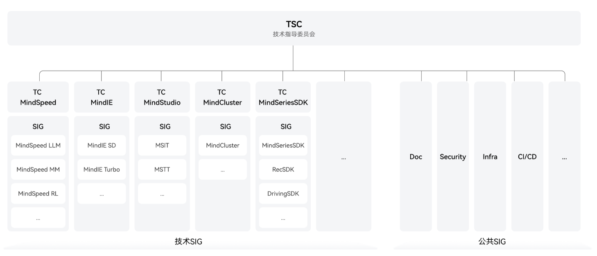

#  Ascend community 仓库整体介绍

##  community简介

community 仓库是昇腾（Ascend）社区的权限与治理中心，用于实现**组织级权限的统一管理**。通过层级化目录与结构化 YAML 配置，实现对项目、SIG、代码仓和成员角色（TC、maintainers、committers、reviewers 等）的统一管理。

## 📌社区治理架构



- [技术指导委员会（TSC）](TSC/README.md) —— 负责技术愿景与方向决策
- 项目技术委员会（TC） —— 统筹项目规划与执行管理
- 特别兴趣小组（SIG） —— 专注特定技术领域或公共能力建设

## 📌 社区治理章程
- [技术指导委员会（TSC）治理章程](docs/tsc-governance.md)
- [项目技术委员会（TC）治理章程](docs/tc-governance.md)
- [特别兴趣小组（SIG）治理章程](docs/sig-governance.md)

## 📌 community核心功能-权限管理

1. **统一权限管理**  
   集中管理 Ascend 组织下所有项目和 SIG 组的成员权限
2. **结构化配置**  
   通过 YAML 文件定义各层级的权限关系
3. **精细化权限控制**  
   支持从项目→SIG→仓库→分支/目录/文件→目录/文件的五级权限配置
4. **职责分离**  
   明确划分 TC 成员、SIG Maintainers、Committers、Reviewers 等角色职责

### 核心管理文件体系

| 文件             | 位置                                      | 核心作用                          | 管理范围       |
|------------------|-------------------------------------------|-----------------------------------|---------------------|
| `org-info.yaml`  | 项目目录（如 `Ascend/community/MindCluster/`） | 定义项目级 TC 成员和 SIG 框架     | 项目全局架构      |
| `sig-info.yaml`  | SIG 目录（如 `sigs/RecSDK/`）           | 配置 SIG 内仓库的精细权限规则     | SIG 组内所有仓库代码合入权限 |
| `sigs/ascend/*.yaml`(*代表仓库名)  | SIG 目录（如 `sigs/ascend/`）           | 定义仓库分支结构与属性     | SIG 组内所有仓库创建 |

### 目录治理结构

community代码仓目录结构对应管理组织结构：

| 分层 | 内容 | 目录层级  |说明|
|--|--|--|--|
|  平台组织 |Ascend   | 0层 |组织
|  仓库    | community  | 一层 |权限管理统一仓库
|  目录    | MindStudio/MindCluster/... | 二层 |项目目录
|  文件    | org-info.yaml  | 三层 |项目成员权限管理
|  目录    | sigs  | 三层 |项目SIG集合
|  目录    | RecSDK/DrivingSDK/... | 四层 |一个SIG一个目录
|  文件    | sig-info.yaml  | 五层 |单个SIG仓库权限管理

具体示例：

```plaintext
Ascend（组织根）
└── community（权限仓库）
    ├── MindStudio（项目）
    │   ├── org-info.yaml
    │   └── sigs（SIG组集合）
    │       ├── msit
    │       │   └── sig-info.yaml (核心权限文件)
    │       │   └── ascend/
    │       │       └── *.yaml（仓库配置）
    │       └── mstt
    ├── MindCluster（项目）
    ├── docs (文档仓库)
    └── common (公共SIG)
        ├── org-info.yaml
        └── sigs（SIG组集合）
            └── infrastructure（基础设施SIG）
                └── sig-info.yaml (核心权限文件)  
                └── ascend/
                    └── *.yaml（仓库配置）
```

### 权限继承与生效规则
继承规则：下层配置覆盖上层。

变更方式：所有权限变更必须通过 PR，并在合并后由同步服务生效（通常 < 10 分钟）；具体生效延迟视同步任务而定。

校验：PR 会触发 CLA、CI、文档 CI 等检查，且需指定角色完成 /lgtm 与 /approve。

### 权限配置快速上手（修改或新增配置）
1. Fork 本仓库并修改对应 YAML（org-info.yaml / sig-info.yaml / ascend/*.yaml）。
2. 提交 PR 至 Ascend/community 的 master 分支。
3. 确保 PR 获得以下标签后可合并（部分通过评论触发）：
   - ascend-cla/yes（CLA检查通过：平台默认邮箱、commit 邮箱、CLA 签署邮箱一致）
   - ci-pipeline-passed（配置CI通过）
   - docs-ci-pipeline-success（文档CI通过）
   - lgtm（由指定 reviewers/committer/maintainers 执行 /lgtm）
   - approved（由指定 committer/maintainers 执行 /approve）

注意：若某 SIG 仅有两位 maintainer，相关涉及该 SIG 的 PR 应由非 maintainer 提交，避免自审阻塞。更多详细教程请查看[《Ascend社区协作指南》](https://gitcode.com/Ascend/community/blob/master/docs/role-guidance.md) 。

### 权限配置相关教程与规范文档

- 📘 [《Ascend社区协作指南》](https://gitcode.com/Ascend/community/blob/master/docs/role-guidance.md) - 所有角色的完整操作流程
- 📋 [《org-info.yaml编写指南》](https://gitcode.com/Ascend/community/blob/master/docs/org-info-guidance.md) - 项目级配置详解
- 🔧 [《sig-info.yaml编写指南》](https://gitcode.com/Ascend/community/blob/master/docs/sig-info-guidance.md) - SIG权限配置详解
- 📁 [《repo-info.yaml编写指南》](https://gitcode.com/Ascend/community/blob/master/docs/repo-info-guidance.md) - 仓库属性管理说明

### 常用命令与触发
- 触发 CI（手动）：在 PR 评论区回复 compile
- 检查 CLA：在 PR 评论区回复 /check-cla
- 检查 PR 是否满足合入条件：/check-pr

## 📌 参与贡献

欢迎所有开发者参与昇腾（Ascend）社区的建设！为确保贡献质量与社区协作顺畅，请在提交代码、参与讨论或承担社区角色前，仔细阅读并遵循以下核心指南与规范。

### 贡献流程指南
了解标准的贡献流程是参与社区的第一步：

- [《Issue 创建与处理指南》](docs/contributor/issue-guide.md) - 学习如何有效创建、分类和管理Issue，包括问题报告、功能请求的规范格式。
- [《Pull Request (PR) 提交流程指南》](docs/contributor/pr-guide.md) - 掌握从Fork到提交、从代码审查到合并的完整PR流程，包括CI检查、标签要求和合并规范。

### 社区行为准则
建立健康的协作环境是社区发展的基础：

- [《社区行为规范》](docs/contributor/code-of-conduct.md) - 定义社区互动的基本准则，确保所有参与者在尊重、包容和友好的环境中协作。

###  代码开发规范
遵循统一的编码标准和安全实践，保障代码质量和安全性：

- [《Ascend C++ 编码风格指南》](docs/contributor/Ascend-cpp-coding-style-guide.md) - C++代码开发规范。
- [《Ascend Python 编码风格指南》](docs/contributor/Ascend-python-coding-style-guide.md) - Python代码开发规范。
- [《Ascend Go 编码风格指南》](docs/contributor/Ascend-go-coding-style-guide.md) - Go语言代码开发规范。

### 安全编程指南
- [《Ascend C++ 安全编程指南》](docs/contributor/Ascend-cpp-secure-coding-guide.md) - C++安全编程指导。
- [《Ascend Python 安全编程指南》](docs/contributor/Ascend-python-secure-coding-guide.md) - Python安全编程指导。
- [《Ascend Go 安全编程指南》](docs/contributor/Ascend-go-secure-coding-guide.md) - Go语言安全编程指导。

###  测试贡献指南

- [《Ascend 社区开发者测试贡献指南》](docs/contributor/developer-testing-guide.md) - 社区鼓励开发者贡献单元测试和系统测试，需遵循版权声明、编码规范等要求，以共同提升软件质量。

###  仓库与依赖管理
掌握第三方代码和依赖的管理规范，确保合规性：

- [《开源与第三方软件建仓及分支命名指导》](docs/contributor/third-party-repo-branch-guide.md) - 说明引入开源软件的标准化流程，仓库命名规则。
- [《开源与第三方软件管理规范》](docs/contributor/third-party-software-management-guide.md) - 指导开源软件引入、使用和分发的合规流程与安全要求。

### 开始您的第一次贡献
1. **熟悉流程**：首先阅读上述流程指南，了解Issue和PR的标准操作。
2. **寻找切入点**：浏览各项目的未分配的Issue，选择适合的起点。
3. **遵循规范**：编码前仔细阅读代码开发规范，确保符合风格与安全要求。
4. **积极沟通**：在Issue或PR中清晰描述问题与解决方案，及时响应审查意见。
5. **持续学习**：参与SIG会议、技术讨论，逐步深入理解社区运作。

我们期待您的加入，共同构建更强大的昇腾开源生态！如有任何疑问，可通过社区交流渠道寻求帮助。


