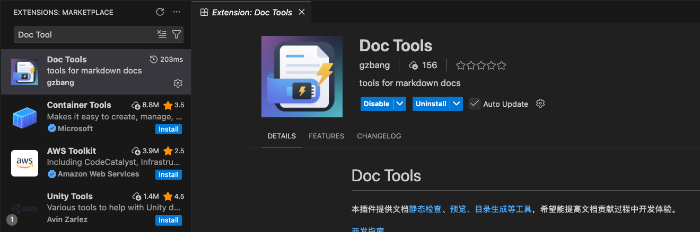
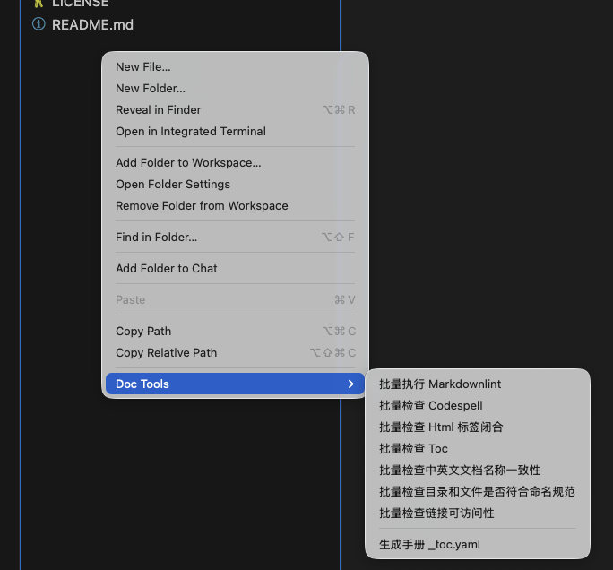

# Doc Tools 安装使用指南

本插件集成了markdownlint、链接失效等多种常见文档问题的自动化检测修复功能，同时提供文档预览等功能，旨在提升文档开发体验。

## 安装

在 Visual Studio Code 中搜索插件并安装：



## 本地扫描

安装完成后，可在文件目录空白处右键，选择*Doc Tool*菜单，并选择需要执行的本地检查。



### 静态检查

当前社区 Doc-CI 中已上线如下检查项，提交代码前需在本地执行完成，确保检查通过。

| 名称 | 功能 |
| -----| ----| 
| [Markdown Lint](./doc-tools-static-check.md#markdown-lint) | Markdown 语法检查 | 
| [Tag Closed Check](./doc-tools-static-check.md#tag-closed-check) | Html 标签闭合检查 | 
| [Link Validity Check](./doc-tools-static-check.md#link-validity-check) | 链接可访问性检查 | 
| [Resource Existence Check](./doc-tools-static-check.md#resource-existence-check) | 资源有效性检查 |

## 全局配置

插件支持以下配置项（可在 VSCode 设置中搜索 `docTools.scope` 或通过 `settings.json` 进行配置）：

- `docTools.scope`
  - 类型：`boolean`
  - 说明：是否检查范围仅限于 `docs/zh` 和 `docs/en` 目录
  - 默认：`false`

### 全局配置示例

```json
{
  "docTools.scope": false // 启用检查范围仅限于 docs/zh 和 docs/en 目录，默认检查项目全局文档
}
```
