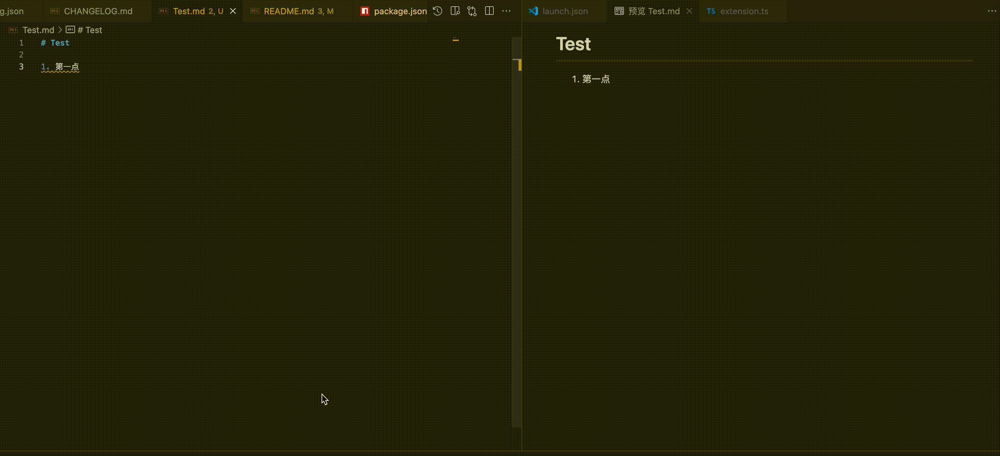
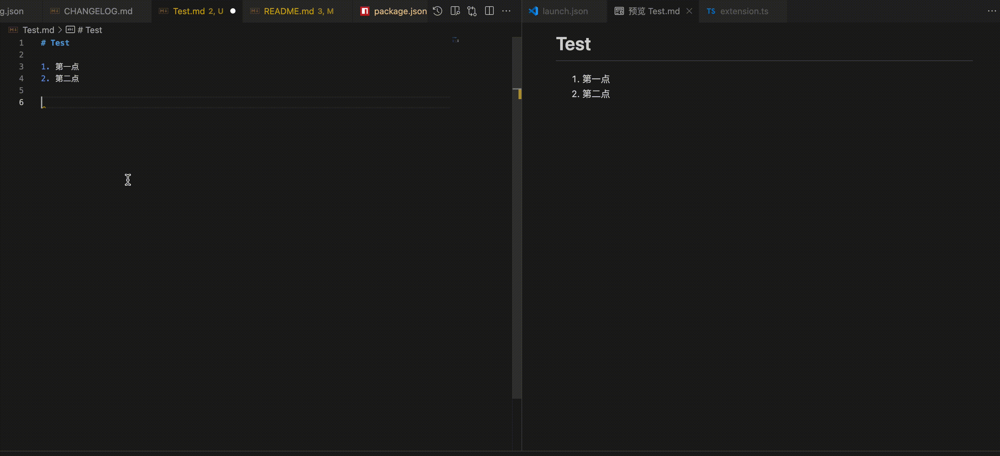
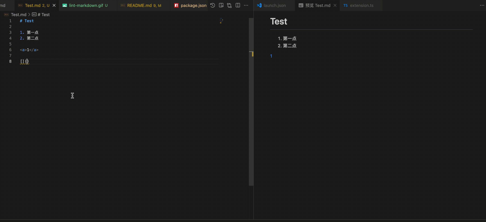

# 静态检查

## Markdown Lint

基于 `markdownlint v0.12.0` 版本实现，帮助用户规范 Markdown 文档格式。



### 功能介绍

- 自动检测 Markdown 文件中的格式问题，如标题格式、列表缩进、空行等；
- 可通过配置项灵活启用或禁用 lint 功能，并支持自定义 lint 规则，满足不同团队或个人的文档规范需求。
- 支持一键修复功能，帮助用户一键修复所有 markdownlint 问题。

### 使用方法

1. 安装并启用本插件，打开 Markdown 文件（`.md`），插件会自动对文件内容进行 lint 检查；
2. 检查结果会以警告（Warning）的形式在编辑器中高亮显示，可在底部问题面板，或将光标悬停在警告标记上，查看详细的规则说明和建议；
3. 可通过 VSCode 提供的 Quick Fix（快速修复）功能，点击灯泡图标或按下快捷键（通常为 `Cmd+.` 或 `Ctrl+.`），一键修复所有 markdownlint 问题。

### 配置说明

插件支持以下配置项（可在 VSCode 设置中搜索 `docTools.markdownlint`或通过`settings.json`进行配置）：

- `docTools.markdownlint`
  - 类型：`boolean`
  - 说明：是否启用 Markdown lint 功能
  - 默认：`true`
- `docTools.markdownlint.config`
  - 类型：`object`
  - 说明：自定义 markdownlint 配置对象。若未设置，则使用插件内置的默认规则。

#### 配置示例

```json
{
  "docTools.markdownlint": true, // 是否开启功能
  "docTools.markdownlint.config": {
    "MD013": false, // 禁用行长度限制
    "MD041": true // 启用标题必须为一级标题
  }
}
```

## Tag Closed Check

检查 Markdown 文件中的 HTML 标签是否正确闭合，帮助用户避免因标签未闭合导致的渲染或语法错误。



### 功能介绍

- 自动检测 Markdown 文件中的 HTML 标签闭合问题；
- 支持快速修复功能，帮助用户一键修正标签闭合和转义问题；
- 支持通过配置项灵活启用或禁用该功能。

### 使用方法

1. 安装并启用本插件，打开 Markdown 文件，自动检查文件内容有效性；
2. 检查结果会以错误（Error）的形式在编辑器中高亮显示，可在底部问题面板，或将光标悬停在错误标记处，查看错误详情；
3. 可通过 VSCode 提供的 Quick Fix（快速修复）功能，点击灯泡图标或按下快捷键（通常为 `Cmd+.` 或 `Ctrl+.`），一键修复标签问题。

### 快速修复说明

- \字符替换：适用于非 Html 标签嵌套的情况，会在对应的 Html 标签前加上 `\` 转义字符；
- &lt;和&gt;字符替换：适用于 Html 标签嵌套的情况，会将 `<` 和 `>` 替换为 `&lt;` 和 `&gt;`；
- 闭合标签：自动为未闭合的标签补全闭合部分。

### 注意事项

- 对于 Html 标签嵌套的情况，如`<table><errorLabel></table>`，请使用`&lt;和&gt;字符替换`方式进行修复，修复后为`<table>&lt;errorLabel&gt;</table>`。

### 配置说明

插件支持以下配置项（可在 VSCode 设置中搜索`docTools.check.tagClosed`或通过`settings.json`进行配置）：

- `docTools.check.tagClosed`
  - 类型：`boolean`
  - 说明：是否启用 HTML 标签闭合检查

#### 配置示例

```json
{
  "docTools.check.tagClosed": true
}
```

## Link Validity Check

检查 Markdown 文档中的链接有效性，帮助用户及时发现失效或错误的链接，提升文档质量。



### 功能介绍

- 链接识别   
  支持自动识别文档中以下三种格式的链接：
  1. `[文本](链接)`形式的标准 Markdown 链接；
  2. `<http://example.com>`形式的裸链接；
  3. `<a href="链接">`形式的 HTML 链接。
- 链接检查  
  1. 支持 HTTP/HTTPS 链接检测，自动忽略链接中的锚点部分（如`#section`），仅校验主链接地址；
  2. 支持对相对路径的文件链接，进行本地文件存在性检查，并可检查锚点的有效性。
- 白名单机制    
  支持配置 HTTP/HTTPS 链接检查白名单，避免对特定可信链接进行报错；
  - 默认从远程配置文件中获取：
    1. 内网地址，如`http://localhost`，`http://192.168.1.60`；
    2. 邮件协议，文件协议，FTP文件协议链接如`ftp://`，`file://`；
  - 支持按需自定义添加新的白名单。
- 灵活配置
  1. 支持通过配置项灵活启用或禁用该功能；
  2. 支持通过配置项启用“仅在链接响应为404（无法访问）时提示”的模式。

### 使用方法

1. 安装并启用插件后，打开任意 Markdown 文件（`.md`），自动检测所有链接的有效性；
2. 无效链接会以错误（Error）的形式在编辑器中高亮显示，可在底部问题面板中，或将光标悬停在警告标记处，查看错误详情；
3. 访问超时的链接会以警告（Warning）的形式在编辑器中高亮显示，可在底部问题面板中，或将光标悬停在警告标记处，查看错误详情。

### 注意事项

- 插件仅检测链接的格式和可达性，不保证目标内容的正确性；
- 某些私有或受限网络下的链接，可能因网络原因被误判为无效；
- 对于本地文件链接，需确保路径正确且文件存在。

### 配置说明

插件支持以下配置项（可在 VSCode 设置中搜索 `docTools.check.linkValidity`或通过`settings.json`进行配置）：

- `docTools.check.linkValidity.enable`
  - 类型：`boolean`
  - 说明：是否启用链接有效性检查
  - 默认：`true`
- `docTools.check.linkValidity.only404.enable`
  - 类型：`boolean`
  - 说明：启用链接有效性检查只在链接无法访问时提示（可减少一些误报）
  - 默认：`true`
- `docTools.check.url.whiteList`
  - 类型：`array`
  - 说明：检测链接白名单（添加后忽略对该链接的检查）
  - 默认：`[]`

#### 配置示例

```json
{
  "docTools.check.linkValidity.enable": true,
  "docTools.check.linkValidity.only404.enable": true,
  "docTools.check.url.whiteList": []
}
```

## Resource Existence Check

检查 Markdown 文件中的资源链接（如图片、视频等）是否存在，帮助用户及时发现无效或丢失的资源引用。

### 功能介绍

- 自动检测 Markdown 文件中的图片、视频等资源链接是否有效，包括 Markdown 语法和 HTML 标签（如 ``、`<image>`、`<video>`）中的资源路径；
- 支持多种资源引用方式，全面覆盖常见的资源链接格式；
- 支持通过配置项灵活启用或禁用该功能。

### 使用方法

1. 安装并启用本插件，打开 Markdown 文件（`.md`），自动检查文档中的资源链接有效性；
2. 检查结果会以警告（Warning）的形式在编辑器中高亮显示，可在“问题”面板，或将光标悬停在警告标记处，查看无效资源的具体路径和提示信息。

### 配置说明

插件支持以下配置项（可在 VSCode 设置中搜索 `docTools.check.resourceExistence` 或通过 `settings.json` 进行配置）：

- `docTools.check.resourceExistence`
  - 类型：`boolean`
  - 说明：是否启用资源存在性检查
  - 默认：`true`

#### 配置示例

```json
{
  "docTools.check.resourceExistence": true
}
```
