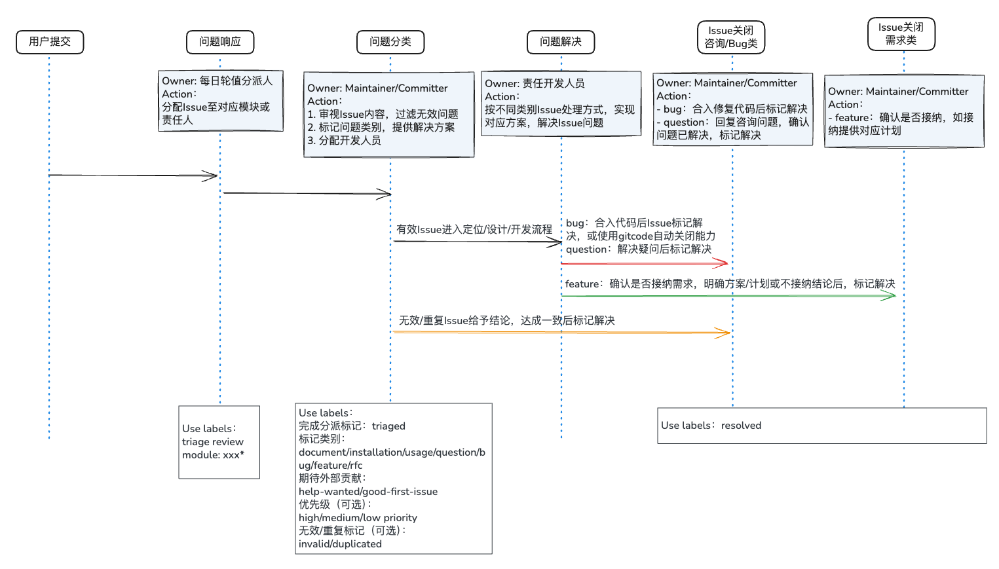

# Issue 处理流程说明

为规范社区及项目中 Issue 的管理流程，明确 Issue 从创建、处理到闭环全生命周期的操作标准，统一标签使用规则、响应时效要求及沟通规范，提升 Issue 处理效率与质量，保障社区贡献者与维护者的协作顺畅，特制定本规范。

## 1. 标签分类说明

### 1.1 社区公示类

| 标签名称 | 含义说明 |
| --- | --- |
| tc-meeting | TC 会议使用相关，呈现 TC 会议议题及内容，供社区开发者开放讨论 |
| sig-meeting | SIG 会议使用相关，呈现 SIG 会议议题及内容，供社区开发者开放讨论 |
| roadmap | 技术发展路线图，长期在社区内公示 |
| sunset | 日落公告，公示社区即将废弃功能和特性，即将停止服务或从代码库移除 |

### 1.2 处理状态类

| 标签名称 | 含义说明 |
| --- | --- |
| triage review | 待分类审核，需维护者评估 issue 性质、优先级 |
| triaged | 已完成分类，明确类型、优先级和归属模块 |
| pending | 等待依赖项完成或外部反馈，暂时无法推进 |
| resolved | 问题已解决，涵盖两种场景：1. 代码修复（对应PR已合并）；2. 非代码解决（如咨询解答、配置指导等，无需代码变更）|
| stale | 长时间无互动，提醒相关方响应，未响应将自动关闭 |
| duplicated | 与已有 issue 重复 |

### 1.3 Issue 内容类型

| 标签名称 | 含义说明 |
| --- | --- |
| document | 文档类问题 |
| installation | 安装部署类问题 |
| usage | 使用类问题 |
| question | 咨询类问题 |
| bug | 功能错误或不符合预期行为 |
| feature | 新功能 |
| rfc | 重大架构调整 |
| cve | 漏洞相关内容 |

### 1.3 处理优先级（可选）

| 标签大类 | 标签名称 | 含义说明 |
| --- | --- | --- |
| high-priority | 高优先级，需紧急处理（严重bug/核心功能影响）|
| medium-priority | 中优先级，按常规流程处理 |
| low-priority | 低优先级，可延后处理（边缘场景）|

### 1.4 社区贡献类（可选）

| 标签名称 | 含义说明 |
| --- | --- |
| help-wanted | 需社区贡献者协助 |
| good-first-issue | 新手入门级问题，难度低 |

## 2. 具体流程示例

### 2.1 首次响应阶段：标签初设

标记 `triage review` 表示问题已有对应人员进行查看，分配归属模块标记：`module: xxx`

- 如社区中不区分模块，跳过标记 `module: xxx`
- 如初步分析无法确定归属模块，可由下一阶段审视责任人在具体分析完问题后进行标记

此阶段完成后 Issue 需要有对应的跟踪处理人。

### 2.2 审视分析阶段：标签细化

根据 Issue 具体内容分析完成后，对 Issue 进行：

- 标记为 `triaged` 表示已完成分析，如是无效问题、或重复问题已有Issue或PR解决：
  - `duplicate` 需关联已有 issue 或 PR 后进行关闭；
  - `invalid` 需给出合理解释后关闭；

- 标记问题的类型：`document`/`Installation`/`Usage`/`question`/`bug`/`feature`/`rfc`;
- 分配指定Issue处理人，如期望外部开发者贡献标记 `help wanted`，适合新手的简单问题额外标记 `good first issue`；

### 2.3 问题闭环阶段：标签终设

标记最终处理状态：

- 解决问题标记：`resolved`，或关闭Issue
