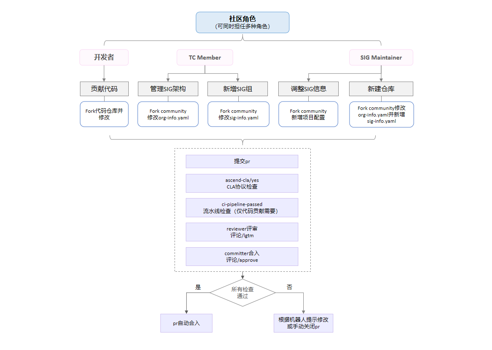

# Ascend 社区协作指南

## 概述

欢迎来到 Ascend 社区！本文档旨在为不同角色的社区成员提供清晰的操作指南。无论您是代码贡献者、SIG maintainer，还是项目TC成员，都可以在此找到对应的协作流程。

### 如何签署Ascend社区贡献者许可协议CLA
在参与社区贡献前，您需要签署[Ascend社区贡献者许可协议（CLA）](https://clasign.osinfra.cn/sign/gitee_ascend-1611222220829317930)
- **个人贡献者**：请选择“签署个人CLA”
- **企业**：请选择“签署法人CLA”
- **企业员工**：请选择“法人贡献者登记”，签署后会收到主题是`Signing CLA on project of xx`的邮件，请联系邮件内容里的`Corporation Managers`进行审批

### 开发者如何贡献代码

1.  **Fork 源码仓库**：将目标源码仓库 Fork 到您的个人账号下
2.  **开发与提交**：在您的 Fork 仓库中进行开发，完成后向上游仓库提交 Pull Request (PR)
3.  **通过审查与检查**：您的 PR 必须获得以下四个标签才能被合并：

    - `ascend-cla/yes`：**CLA协议检查**。机器人会自动检查您 commits 中的邮箱是否已签署 CLA 协议。若已签署，将添加此标签；若未签署，会添加 `ascend-cla/no` 标签并留言提示
    - `ci-pipeline-passed`：**CI流水线检查**。在 PR 评论区评论 `compile` 以触发 CI。通过后机器人会添加此标签；若失败，则添加 `ci-pipeline-failed` 标签
    - `lgtm`：**技术评审**。CI 通过后，请联系仓库对应 SIG 组的 `sig-info.yaml` 中指定的 **Reviewers**。需要至少两位 Reviewer 评论 `/lgtm`
    - `approved`：**最终批准**。CI 通过后，请联系仓库对应 SIG 组的 `sig-info.yaml` 中指定的 **Committers**。需要至少一位 Committer 评论 `/approve`

### 如何调整社区 SIG 架构
#### 适用角色： TC members

1.  **Fork 并修改**：Fork `Ascend/community` 仓库到您的个人账号，修改 `org-info.yaml` 文件（[org-info.yaml编写指南](https://gitcode.com/Ascend/community/blob/master/org-info-guidance.md)）。
2.  **提交 PR**：向 `Ascend/community` 仓库的 `master` 分支提交 PR
3.  **通过审查**：您的 PR 需要获得以下三个标签才能被合并：

    - `ascend-cla/yes`：**CLA协议检查**。机器人会自动检查您 commits 中的邮箱是否已签署 CLA 协议。若已签署，将添加此标签；若未签署，会添加 `ascend-cla/no` 标签并留言提示
    - `lgtm`：请联系 `org-info.yaml` 文件中列出的 **tc_members** 进行评审。评审通过后，由一位 tc_member 评论 `/lgtm`，机器人会自动添加标签
    - `approved`：同样联系 **tc_members** 进行批准。批准后，由一位 tc_member 评论 `/approve`，机器人会自动添加标签

### 如何调整 SIG 信息文件
#### 适用角色： SIG maintainers

1.  **Fork 并修改**：Fork `Ascend/community` 仓库，修改目标 SIG 的 `sig-info.yaml` 文件([sig-info.yaml编写指南](https://gitcode.com/Ascend/community/blob/master/sig-info-guidance.md))。
2.  **提交 PR**：向 `Ascend/community` 仓库的 `master` 分支提交 PR
3.  **通过审查**：您的 PR 需要获得以下三个标签才能被合并：

    - `ascend-cla/yes`：**CLA协议检查**。机器人会自动检查您 commits 中的邮箱是否已签署 CLA 协议。若已签署，将添加此标签；若未签署，会添加 `ascend-cla/no` 标签并留言提示
    - `lgtm`：请联系 `org-info.yaml` 中该 SIG 组的 **maintainers** 进行评审。评审通过后，由 maintainer 评论 `/lgtm`
    - `approved`：同样联系该 SIG 组的 **maintainers** 进行批准。批准后，由 maintainer 评论 `/approve`

> **⚠️ 注意事项**：如果某个 SIG 组只有一位 maintainer，则修改 `sig-info.yaml` 文件的 PR **必须由非 maintainer 的成员**提交，以避免无法通过 `/lgtm` 和 `/approve` 指令添加标签的情况

### 如何新增 SIG 组
#### 适用角色： TC members
新增 SIG 组需要分两步完成两个独立的 Pull Request：

#### 第一步：修改组织架构

1.  **Fork 并修改**：Fork `Ascend/community` 仓库，修改 `org-info.yaml` 文件([org-info.yaml编写指南](https://gitcode.com/Ascend/community/blob/master/org-info-guidance.md))，新增该 SIG 组的定义。
2.  **提交 PR**：提交 PR 至 `master` 分支
3.  **通过审查**：此 PR 需获得 `ascend-cla/yes`, `lgtm`, `approved` 三个标签。评审流程与【调整社区 SIG 架构】完全相同，需由 **tc_members** 进行 `/lgtm` 和 `/approve`

#### 第二步：创建 SIG 目录和信息文件

1.  **在第一PR合并后**，在相应项目的 `sigs` 目录下创建新的 SIG 组目录
2.  **创建信息文件**：在该目录中创建 `sig-info.yaml` 文件([sig-info.yaml编写指南](https://gitcode.com/Ascend/community/blob/master/sig-info-guidance.md))，并配置 maintainers、committers 等信息
3.  **提交 PR**：提交第二个 PR 至 `master` 分支
4.  **通过审查**：此 PR 需获得 `ascend-cla/yes`, `lgtm`, `approved` 三个标签。评审流程与【调整 SIG 信息文件】完全相同，需由**新 SIG 组的 maintainers** 进行评审和批准

> **⚠️ 注意事项**：如果新 SIG 组初始只有一位 maintainer，则第二步的 PR **必须由其他成员（非该 maintainer）** 提交

### 如何在社区新增/修改项目
#### 适用角色： 新项目 TC members
1.  **Fork 并创建**：Fork `Ascend/community` 仓库。参考现有项目的结构，创建新的项目目录并添加 `org-info.yaml` 文件 ([org-info.yaml编写指南](https://gitcode.com/Ascend/community/blob/master/org-info-guidance.md))
2.  **提交 PR**：向 `Ascend/community` 仓库的 `master` 分支提交 PR
3.  **通过审查**：您的 PR 需要获得以下三个标签才能被合并：

    - `ascend-cla/yes`：**CLA协议检查**。机器人会自动检查您 commits 中的邮箱是否已签署 CLA 协议。若已签署，将添加此标签；若未签署，会添加 `ascend-cla/no` 标签并留言提示
    - `lgtm`：请联系 [infrastructure](https://gitcode.com/Ascend/community/blob/master/infrastructure/sigs/community/sig-info.yaml) SIG 的 **committer** 进行评审。评审通过后，由其评论 `/lgtm`
    - `approved`：同样联系 [infrastructure](https://gitcode.com/Ascend/community/blob/master/infrastructure/sigs/community/sig-info.yaml) SIG 的 **committer** 进行批准。批准后，由其评论 `/approve`

### 如何在Ascend组织新增一个代码仓
#### 适用角色：SIG Maintainer**

1.  **Fork 并创建**：Fork `Ascend/community` 仓库。参考现有项目的结构，在对应SIG目录下添加 `ascend/*.yaml` 文件。([repo-info.yaml编写指南](https://gitcode.com/Ascend/community/blob/master/repo-info-guidance.md))
2.  **提交 PR**：向 `Ascend/community` 仓库的 `master` 分支提交 PR
3.  **通过审查**：您的 PR 需要获得以下三个标签才能被合并：

    - `ascend-cla/yes`：**CLA协议检查**。机器人会自动检查您 commits 中的邮箱是否已签署 CLA 协议。若已签署，将添加此标签；若未签署，会添加 `ascend-cla/no` 标签并留言提示
    - `lgtm`：请联系 `org-info.yaml` 中该 SIG 组的 **maintainers** 进行评审。评审通过后，由 maintainer 评论 `/lgtm`
    - `approved`：同样联系该 SIG 组的 **maintainers** 进行批准。批准后，由 maintainer 评论 `/approve`

> **⚠️ 注意事项**：如果某个 SIG 组只有一位 maintainer，则新增或者修改 `repo-info.yaml` 文件的 PR **必须由非 maintainer 的成员**提交，以避免无法通过 `/lgtm` 和 `/approve` 指令添加标签的情况

### 如何撤销已添加的标签
- 撤销`ascend-cla/yes`标签：仓库管理员评论 `/cla-cancel`
- 撤销`/lgtm`标签：Reviewer、Committer、maintainer或者tc_member评论 `/lgtm cancel`
- 撤销`approved`标签：Committer、maintainer或者tc_member评论 `/approve cancel`

### 如何主动触发检查PR commits 中的邮箱是否签署CLA协议
评论`/check-cla`触发检查CLA协议

### 如何主动触发检查PR是否满足条件合入
评论`/check-pr`触发检查

---
希望本指南能帮助您更顺畅地参与 Ascend 社区贡献。